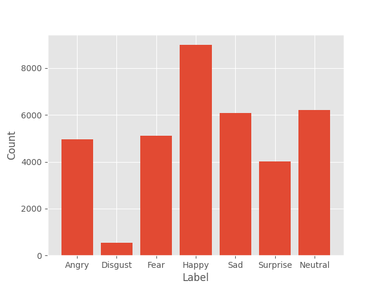
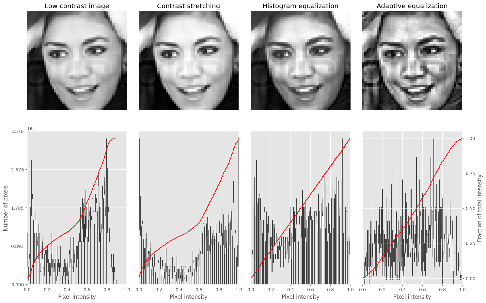
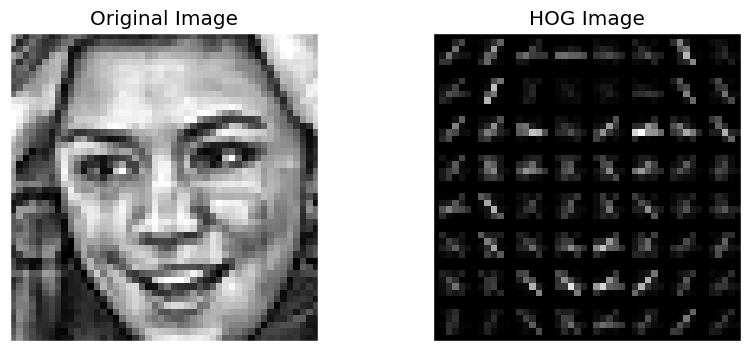
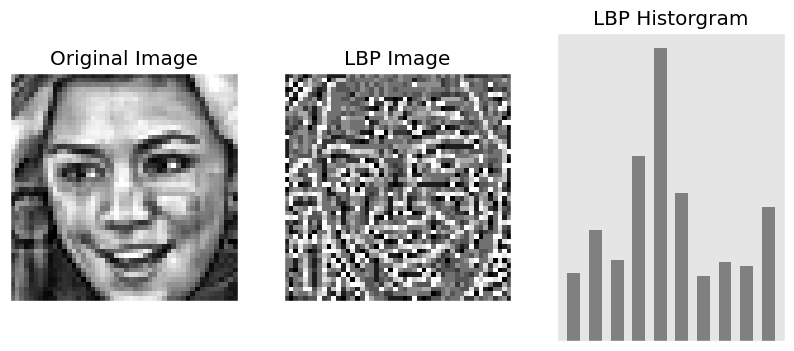
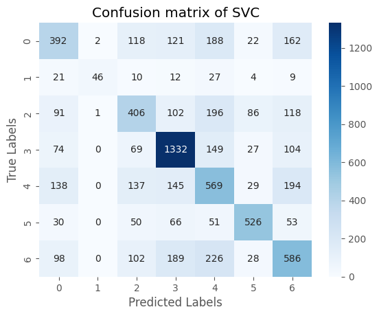
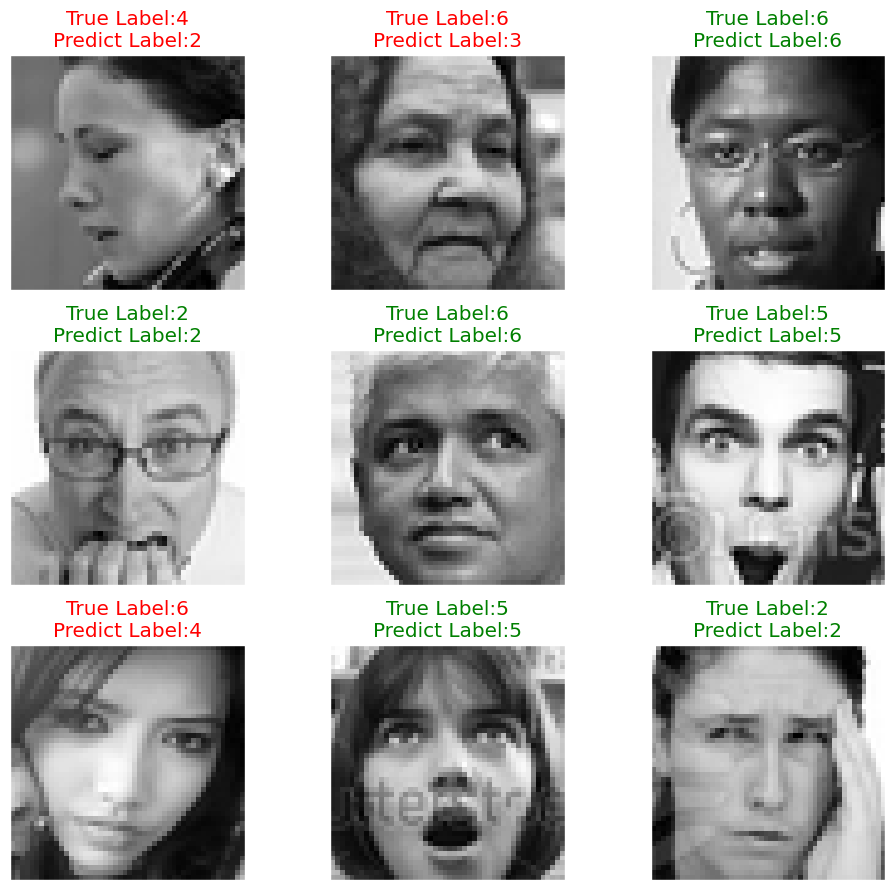

# Mini-Project for Fundamentals of Machine Learning Course


This repository contains the code and data for a mini-project on facial expression recognition using machine learning algorithms.

## 📌 Table of Contents

1. [📑 Project Policy](#-project-policy)
2. [📦 Project Structure](#-project-structure)
3. [📋 Project Description](#-project-description)

   3.1. [Prerequisite](#1-prerequisite)
   
   3.2. [About Dataset](#2-about-dataset)

   3.3. [Preprocessing](#3-preprocessing)

   3.4. [Feature Extraction](#4-feature-extraction)

   3.5. [Classification Performance](#5-classification-performance)

   3.6. [Predictions](#6-predictions)

   3.7. [References](#7-references)
5. [⚙️ Usage](#️-usage)

## 📑 Project Policy

- Team: group should consist of 5 students **(approved by instructor - Tai Ng)**.

| No. | Student Name        | Student ID |
| --- | ------------------- | ---------- |
| 1   | Trương Quốc Huy     | 21110308   |
| 2   | Bùi Ngọc Kim Lan    | 21110330   |
| 3   | Huỳnh Thị Diễm Hằng | 21110290   |
| 4   | Nguyễn Đăng Khoa    | 21110322   |
| 5   | Lê Hoài Tuấn Kiệt   | 21110326   |

- The submission deadline is strict: **11:59 PM** on **June 22nd, 2024**. Commits pushed after this deadline will not be considered.

## 📦 Project Structure

The repository is organized into the following directories:

- **/data**: This directory contains the facial expression dataset. You'll need to download the dataset and place it here before running the notebooks. (Download link provided below)
- **/notebooks**: This directory contains the Jupyter notebook `EDA.ipynb`. This notebook guides you through exploratory data analysis (EDA) and classification tasks.

## 📋 Project Description

### 1. Prerequisite

```sh
pip install -r requirements.txt
```

If you have GPU for training Machine Learning models

```sh
pip install --extra-index-url https://pypi.nvidia.com cuml-cu12
```

### 2. About Dataset

The dataset includes more than 35,000 images, each depicting one of seven distinct facial expressions. Each image is presented in 48x48 pixel grayscale format. The seven facial expressions shown are: anger, disgust, fear, happiness, sadness, surprise, and neutral. In the data set, expressions of joy were the most common, while expressions of disgust were the least common.



### 3. Preprocessing

In this project, we preprocessed the dataset by normalizing the pixel values. We also applied Adapted Histogram Equalization (AHE) to enhance the image contrast.



### 4. Feature Extraction

In this project, we used HoG



and Local Binary Pattern (LBP) features.



### 5. Classification Performance

The classification performance of the model is shown in the following table:

<table class="tg"><thead>
  <tr>
    <th class="tg-iazd"><span style="font-weight:bold">Dataset</span></th>
    <th class="tg-iazd">Model</th>
    <th class="tg-iazd">F1 Score</th>
    <th class="tg-iazd">Time Fit</th>
    <th class="tg-iazd">Time Predict</th>
  </tr></thead>
<tbody>
  <tr>
    <td class="tg-xvll" rowspan="4">Original</td>
    <td class="tg-oi39">SVM</td>
    <td class="tg-oi39">0.5399</td>
    <td class="tg-oi39">10.8463s</td>
    <td class="tg-oi39">2.0290s</td>
  </tr>
  <tr>
    <td class="tg-oi39">XGBoost</td>
    <td class="tg-oi39">0.5017</td>
    <td class="tg-oi39">111.0741s</td>
    <td class="tg-oi39">0.1601s</td>
  </tr>
  <tr>
    <td class="tg-oi39">Logistic</td>
    <td class="tg-oi39">0.4382</td>
    <td class="tg-oi39">32.2772s</td>
    <td class="tg-oi39">0.0358s</td>
  </tr>
  <tr>
    <td class="tg-oi39">MLP</td>
    <td class="tg-oi39">0.4578</td>
    <td class="tg-oi39">47.1000s</td>
    <td class="tg-oi39">0.5184s</td>
  </tr>
  <tr>
    <td class="tg-xvll" rowspan="4">Transformed</td>
    <td class="tg-oi39">SVM</td>
    <td class="tg-r2ay">0.5427</td>
    <td class="tg-oi39">7.0517s</td>
    <td class="tg-oi39">1.6346s</td>
  </tr>
  <tr>
    <td class="tg-oi39">XGBoost</td>
    <td class="tg-oi39">0.4669</td>
    <td class="tg-oi39">48.3098s</td>
    <td class="tg-oi39">0.0834s</td>
  </tr>
  <tr>
    <td class="tg-oi39">Logistic</td>
    <td class="tg-oi39">0.4355</td>
    <td class="tg-ko76">0.4269s</td>
    <td class="tg-ko76">0.0258s</td>
  </tr>
  <tr>
    <td class="tg-oi39">MLP</td>
    <td class="tg-oi39">0.4500</td>
    <td class="tg-oi39">30.3289s</td>
    <td class="tg-oi39">0.4690s</td>
  </tr>
</tbody></table>

Confusion matrix of SVM model with Transfromed Data:



### 6. Predictions



### 7. References

- [Skimage: Adapted Histogram Equalization - AHE](https://scikit-image.org/docs/stable/auto_examples/color_exposure/plot_equalize.html)
- [Skimage: HoG &amp; LBP](https://scikit-image.org/docs/stable/auto_examples/features_detection/plot_hog.html)
- [Machine Learning Mastery: How to Grid Search Hyperparameters for Deep Learning Models in Python with Keras](https://machinelearningmastery.com/grid-search-hyperparameters-deep-learning-models-python-keras/)

## ⚙️ Usage

This project is designed to be completed in the following steps:

1. **Fork the Project**: Click on the `Fork` button on the top right corner of this repository, this will create a copy of the repository in your own GitHub account. Complete the table at the top by entering your team member names.
2. **Download the Dataset**: Download the facial expression dataset from the following [link](https://mega.nz/file/foM2wDaa#GPGyspdUB2WV-fATL-ZvYj3i4FqgbVKyct413gxg3rE) and place it in the **/data** directory:
3. **Complete the Tasks**: Open the `notebooks/EDA.ipynb` notebook in your Jupyter Notebook environment. The notebook is designed to guide you through various tasks, including:

   1. Prerequisite
   2. Principle Component Analysis
   3. Image Classification
   4. Evaluating Classification Performance

   Make sure to run all the code cells in the `EDA.ipynb` notebook and ensure they produce output before committing and pushing your changes.

4. **Commit and Push Your Changes**: Once you've completed the tasks outlined in the notebook, commit your changes to your local repository and push them to your forked repository on GitHub.

Feel free to modify and extend the notebook to explore further aspects of the data and experiment with different algorithms. Good luck.
